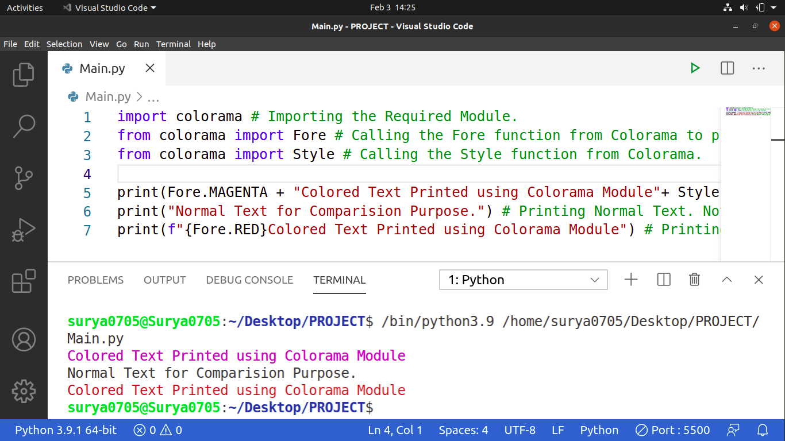

# Colored_Python_Text
This is a Python Program that Prints Colored Text in your Terminal. It uses a built-in Module named 'colorama'. In my system it was pre-installed. If it isn't installed in your system then just use the following command to install it (Assuming that you are on Windows):
```
pip install colorama
```
Or if You are on Ubuntu (20.04 LTS which I use) then just type:
```
pip3 install colorama
```
Below is the Screenshot of My Program:


And Yeah, Here I have used light VS Code theme so I have Printed Colors according to that. Feel Free to Experiment with Colors and find the Right Shade for your Terminal.
And Finally I Hope that you liked it.
